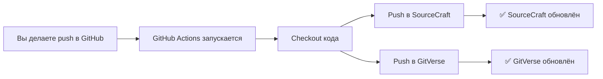

# Настройка автоматической синхронизации через GitHub Actions

Этот workflow автоматически синхронизирует код из GitHub в SourceCraft и GitVerse при каждом push.

## 🔧 Настройка

### Шаг 1: Получите токены доступа

#### Для SourceCraft:
1. Зайдите в настройки профиля SourceCraft
2. Найдите раздел "Personal Access Tokens" или "Токены доступа"
3. Создайте новый токен с правами на запись в репозитории
4. Скопируйте токен

#### Для GitVerse:
1. Зайдите в настройки профиля GitVerse
2. Найдите раздел "Personal Access Tokens" или "Токены доступа"
3. Создайте новый токен с правами на запись в репозитории
4. Скопируйте токен

### Шаг 2: Добавьте токены в GitHub Secrets

1. Откройте ваш репозиторий на GitHub
2. Перейдите в **Settings** → **Secrets and variables** → **Actions**
3. Нажмите **New repository secret**
4. Добавьте два секрета:

   **Name:** `SOURCECRAFT_TOKEN`  
   **Secret:** [вставьте токен SourceCraft]

   **Name:** `GITVERSE_TOKEN`  
   **Secret:** [вставьте токен GitVerse]

### Шаг 3: Проверьте workflow

Workflow находится в файле `.github/workflows/sync-mirrors.yml`

Он запускается автоматически при:
- Push в ветку `main` или `master`
- Ручном запуске через вкладку **Actions** → **Sync to Mirrors** → **Run workflow**

---

## 📊 Как это работает



### Логика работы:

1. **Trigger**: При push в GitHub
2. **Checkout**: Получает полную историю коммитов
3. **Add remotes**: Добавляет SourceCraft и GitVerse как remote
4. **Push**: Пушит изменения в оба репозитория
5. **Continue on error**: Если один из пушей失败, другой продолжится

---

## ⚙️ Конфигурация workflow

### Изменение веток для синхронизации

По умолчанию синхронизируются `main` и `master`. Чтобы изменить:

```yaml
on:
  push:
    branches: [main, develop, release/*]  # Ваши ветки
```

### Синхронизация только определённых платформ

Если нужно синхронизировать только одну платформу, закомментируйте ненужный шаг:

```yaml
# - name: Push to SourceCraft
#   ...

- name: Push to GitVerse
  ...
```

### Частота синхронизации

По умолчанию: при каждом push

Можно добавить ограничение по времени:

```yaml
on:
  push:
    branches: [main]
  schedule:
    - cron: '0 */6 * * *'  # Каждые 6 часов
```

---

## 🔍 Мониторинг

### Просмотр логов синхронизации

1. Перейдите в **Actions** на GitHub
2. Выберите workflow **Sync to Mirrors**
3. Кликните на последний запуск
4. Смотрите логи шагов "Push to SourceCraft" и "Push to GitVerse"

### Статус синхронизации

После каждого запуска в **Summary** будет отображаться:

```
## 🔄 Sync Summary

- ✅ GitHub: Updated (trigger)
- 🔄 SourceCraft: ✅ Synced
- 🔄 GitVerse: ✅ Synced
```

---

## ❓ Решение проблем

### Ошибка: "Authentication failed"

**Причина:** Неверный или отсутствующий токен

**Решение:**
1. Проверьте что секреты добавлены правильно
2. Убедитесь что токен имеет права на запись
3. Перегенерируйте токен если нужно

### Ошибка: "Repository not found"

**Причина:** Неверный URL репозитория

**Решение:**
Проверьте URL в workflow:
```yaml
git remote add sourcecraft https://sourcecraft.dev/ipushechnikov/terminal-launcher.git
git remote add gitverse https://gitverse.ru/ipushechnikov/terminal-launcher.git
```

### Ошибка: "Permission denied"

**Причина:** Токен не имеет прав на push

**Решение:**
1. Проверьте права токена на платформе
2. Убедитесь что у вас есть доступ на запись в репозиторий

### Синхронизация не запускается

**Причина:** Workflow отключён или нет прав

**Решение:**
1. Проверьте что workflow файл закоммичен в репозиторий
2. Убедитесь что GitHub Actions включены в настройках репозитория
3. Проверьте права доступа к репозиторию

---

## 💡 Советы

### 1. Используйте SSH вместо HTTPS (более безопасно)

Вместо токенов можно использовать SSH ключи:

```yaml
- name: Setup SSH
  uses: webfactory/ssh-agent@v0.8.0
  with:
    ssh-private-key: ${{ secrets.SSH_PRIVATE_KEY }}

- name: Push to mirrors
  run: |
    git remote set-url sourcecraft git@sourcecraft.dev:ipushechnikov/terminal-launcher.git
    git remote set-url gitverse git@gitverse.ru:ipushechnikov/terminal-launcher.git
    git push sourcecraft main
    git push gitverse main
```

### 2. Добавьте проверку статуса перед push

```yaml
- name: Check if sync needed
  run: |
    if git diff --quiet HEAD sourcecraft/main && git diff --quiet HEAD gitverse/main; then
      echo "No changes to sync"
      exit 0
    fi
```

### 3. Уведомления о статусе

Добавьте уведомление в Telegram/Discord при ошибке:

```yaml
- name: Notify on failure
  if: failure()
  run: |
    curl -X POST https://api.telegram.org/bot${{ secrets.TELEGRAM_BOT_TOKEN }}/sendMessage \
      -d chat_id=${{ secrets.TELEGRAM_CHAT_ID }} \
      -d text="❌ Sync failed!"
```

---

## 🎯 Альтернатива: Ручная синхронизация

Если автоматическая синхронизация не нужна, используйте локальные скрипты:

```bash
# Windows
scripts\sync-repos.bat all

# Linux/macOS
./scripts/sync-repos.sh all
```

Преимущества ручной синхронизации:
- Полный контроль
- Нет зависимости от GitHub Actions
- Можно выбрать какие remote синхронизировать

---

<div align="center">

**Автоматическая синхронизация настроена! 🚀**

</div>
